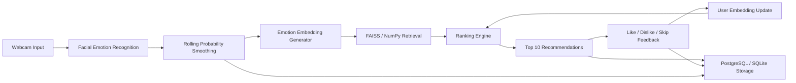

# Mood-Based Music Recommendation System

A production-oriented AI project that detects facial emotion from a webcam frame, converts emotion probabilities into a vector, retrieves Spotify-like songs, ranks them, and learns from like/dislike/skip feedback.

## What Is Implemented

- Webcam frontend with emotion probability bars and top-10 song recommendations.
- Python FastAPI backend.
- Pretrained emotion model plug-in boundary:
  - `deepface` provider for pretrained facial emotion recognition.
  - `visual` provider only as a fallback when DeepFace cannot load.
- Rolling emotion probability smoothing across frames.
- Emotion embedding generator.
- Song embedding generator from Spotify audio features.
- Retrieval engine:
  - FAISS `IndexFlatIP` when FAISS is installed.
  - NumPy cosine fallback when FAISS is not installed.
- Ranking engine using emotion similarity, popularity, novelty, diversity, and user personalization.
- Feedback learning from like/dislike/skip.
- SQLite by default for local use, PostgreSQL schema and deployment config for production.
- Dockerfile and Render deployment blueprint.

## Run Locally

```bash
python3 -m venv .venv
source .venv/bin/activate
pip install -r requirements.txt
python run.py
```

Open `http://localhost:8000`.

For the pretrained facial emotion model, install the ML dependencies and run with DeepFace:

```bash
pip install -r requirements-ml.txt
MOOD_MUSIC_EMOTION_PROVIDER=deepface python run.py
```

DeepFace stores pretrained weights under `.models/.deepface/weights` in this project. The first run downloads `facial_expression_model_weights.h5`. The app health endpoint reports whether the active detector is truly `deepface` or a fallback.

## Dataset Sources

Use the included sample CSV for a runnable demo. For a large catalog, replace `backend/data/sample_spotify_tracks.csv` or set `MOOD_MUSIC_CATALOG_PATH`.

- Spotify 600K Tracks: [Kaggle Spotify Dataset 1921-2020, 600k+ Tracks](https://www.kaggle.com/datasets/yamaerenay/spotify-dataset-19212020-600k-tracks). It contains Spotify Web API audio features and popularity fields.
- Million Song Dataset: [official Million Song Dataset](https://millionsongdataset.com/). It provides metadata and derived audio features for one million tracks.
- Last.fm tags and similarity: [official Last.fm dataset page in the Million Song Dataset project](https://millionsongdataset.com/lastfm/). Useful for tag-based hybrid recommendation.
- Last.fm listening logs: [Zenodo lastfm Music Recommendation Dataset](https://zenodo.org/records/6090214). Useful for user histories and collaborative signals.
- MagnaTagATune: [official MagnaTagATune dataset](https://mirg.city.ac.uk/codeapps/the-magnatagatune-dataset). Useful for music tags and audio research.

Required columns for this app:

```text
track_name, artist_name, genre, valence, energy, tempo, danceability,
acousticness, speechiness, instrumentalness, liveness, loudness, popularity
```

## Architecture



## ML Design

### Emotion Embedding

The emotion detector returns probabilities over:

```text
happy, sad, angry, fear, surprise, neutral, disgust
```

Each emotion has a target audio-feature centroid. For example, happy maps toward high valence, high danceability, and moderate-high energy; sad maps toward low valence, lower energy, higher acousticness, and slower tempo.

The embedding is a weighted sum:

```text
emotion_embedding = normalize(sum(P(emotion_i) * centroid_i))
```

This preserves uncertainty. A face that is 82% happy and 12% neutral is not forced into a single hard label.

### Song Embedding

Each song is converted into the same feature space:

```text
valence, energy, danceability, acousticness, speechiness,
instrumentalness, liveness, tempo, loudness, popularity
```

Tempo, loudness, and popularity are scaled into `[0, 1]`, then the vector is L2-normalized.

### Similarity Search

The retrieval score is cosine similarity:

```text
cosine(a, b) = dot(a, b) / (||a|| * ||b||)
```

Because embeddings are normalized, cosine similarity becomes an inner product. FAISS `IndexFlatIP` is used when installed, which is exact, simple, and good for a first production baseline. For millions of songs, move to FAISS IVF/HNSW/PQ depending on latency and memory constraints.

### FAISS vs Qdrant

FAISS is the better default here because the catalog is mostly local numeric audio features, the app needs fast vector search, and there is no immediate need for distributed vector database operations. Qdrant is better when you need a managed service, metadata filtering at scale, multi-tenant vector storage, snapshots, replication, and operational APIs.

Recommendation: start with FAISS for model iteration and batch-built catalogs. Move to Qdrant when deployment needs distributed persistence, filtering, and operational simplicity.

### Ranking Model

This implementation uses a transparent scoring model:

```text
rank = 0.48 * emotion_similarity
     + 0.18 * popularity
     + 0.16 * novelty
     + 0.18 * personalization
     + feedback_bonus
     - diversity_penalty
```

For a larger labeled dataset:

- Random Forest: easy baseline, less ideal for ranking.
- XGBoost: strong tabular model, widely used, good baseline.
- LightGBM: best recommendation for production learning-to-rank because it supports LambdaRank, scales well, and handles tabular ranking features efficiently.
- Neural ranking model: useful when you have large-scale logs, sequence features, text/audio embeddings, and enough data to avoid overfitting.

Recommendation: use LightGBM LambdaRank after collecting enough feedback labels.

### Personalization

The user embedding is updated from feedback:

- Like moves the user vector toward the song.
- Dislike moves it away more strongly.
- Skip moves it away mildly.

This is an online learning approximation that works immediately with sparse feedback. In a mature system, use it with session history, long-term listening history, and collaborative filtering features.

### Feedback Learning Options

- Online learning: simplest and implemented here. Fast personalization, low operational complexity.
- Bandits: best next step. Use epsilon-greedy, UCB, or Thompson Sampling to balance exploration and exploitation.
- Reinforcement learning: powerful but usually overkill until you model long-horizon outcomes such as retention, repeat listening, and playlist completion.

Recommendation: online user embeddings now, contextual bandits next, reinforcement learning only after significant logged interaction data.

## Deployment

### Docker

```bash
docker build -t mood-music-recommender .
docker run -p 8000:8000 mood-music-recommender
```

### Render

Use `deploy/render.yaml` as a Render Blueprint. It creates:

- A Docker web service.
- A PostgreSQL database.
- Environment variables for the app.

For production DeepFace deployment, use a larger instance and set:

```text
MOOD_MUSIC_EMOTION_PROVIDER=deepface
```

## Project Structure

```text
backend/app/main.py                  FastAPI routes and app boot
backend/app/recommender/emotion.py   Emotion provider and smoothing
backend/app/recommender/embeddings.py Emotion/song vector logic
backend/app/recommender/retrieval.py FAISS/NumPy retrieval
backend/app/recommender/ranker.py    Ranking algorithm
backend/app/recommender/personalization.py Feedback learning
frontend/                            Static webcam UI
docs/postgres_schema.sql             PostgreSQL schema
deploy/render.yaml                   Render deployment blueprint
```
